# EIDReader, an program that uses authentification by using Serbian smart card id. If doesn't have role `admin`, it's redirected back to welcome.

## I didn't added dasboard for assigning role. I've made this  for demonstration purposes only. 

## Reading an id is done in c++. Url to c++ repo: https://github.com/codename11/EIDReader1

#### You can only get to `Listing` if card is present in reader.
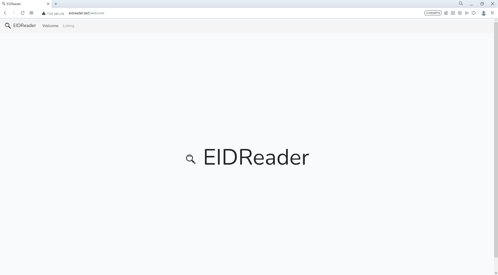

#### If card is present, it list all users/members.
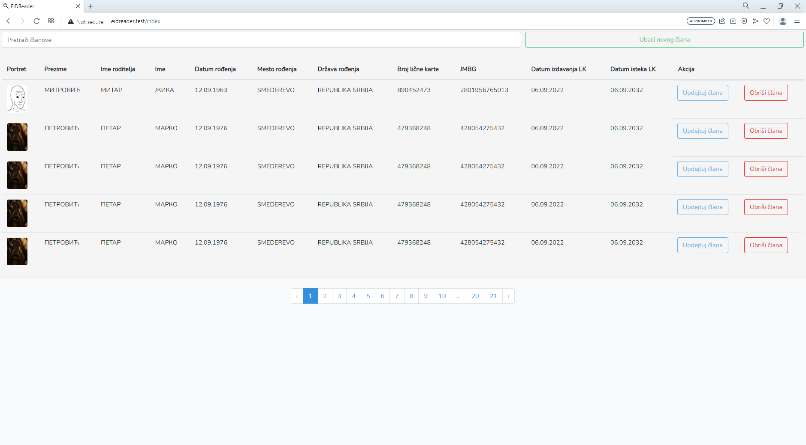

#### If you use search...
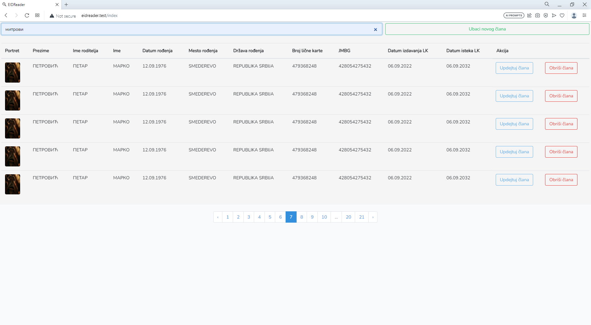

#### Filtered out, can be more if search term used has several records to show, but not more then pagination(5).
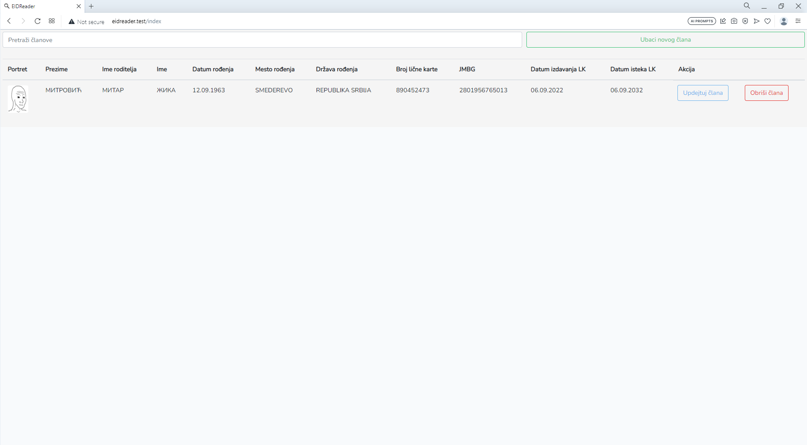

#### If you choose particular member.
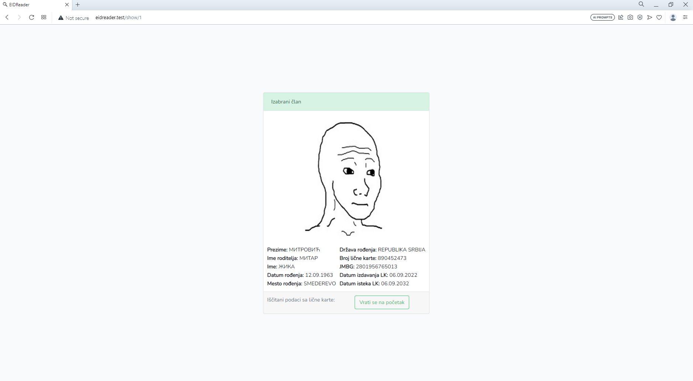

#### When you update particular member.
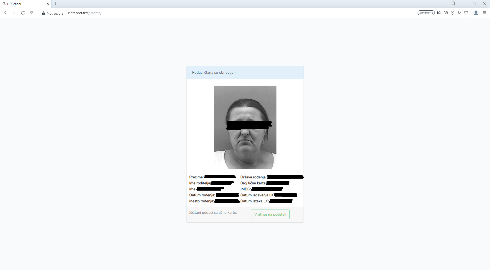

#### Updated member in table.
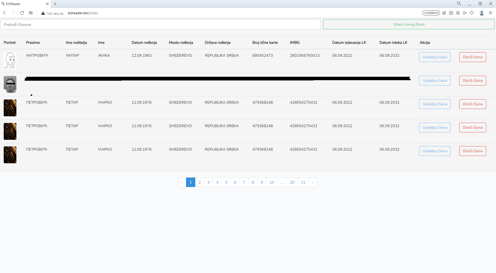

#### When member gets deleted.
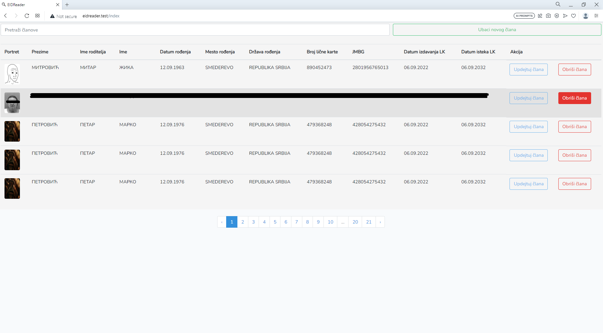

#### And showing deleted member.
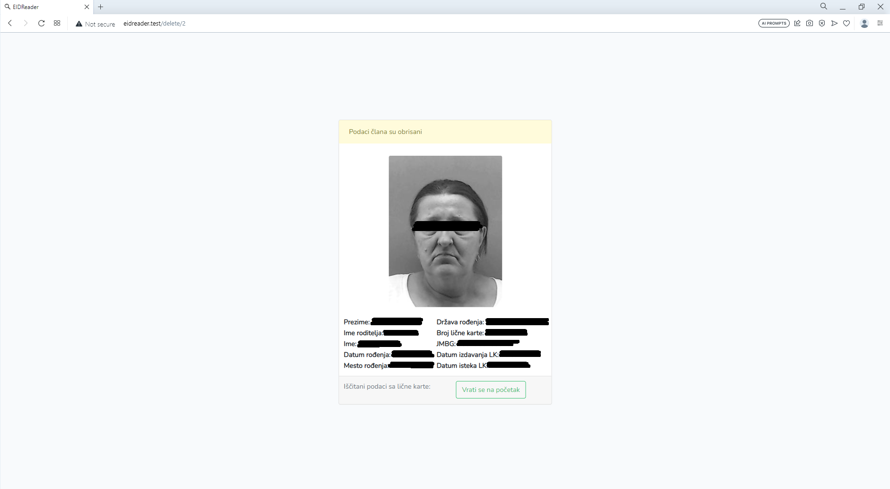

#### If you add new member.
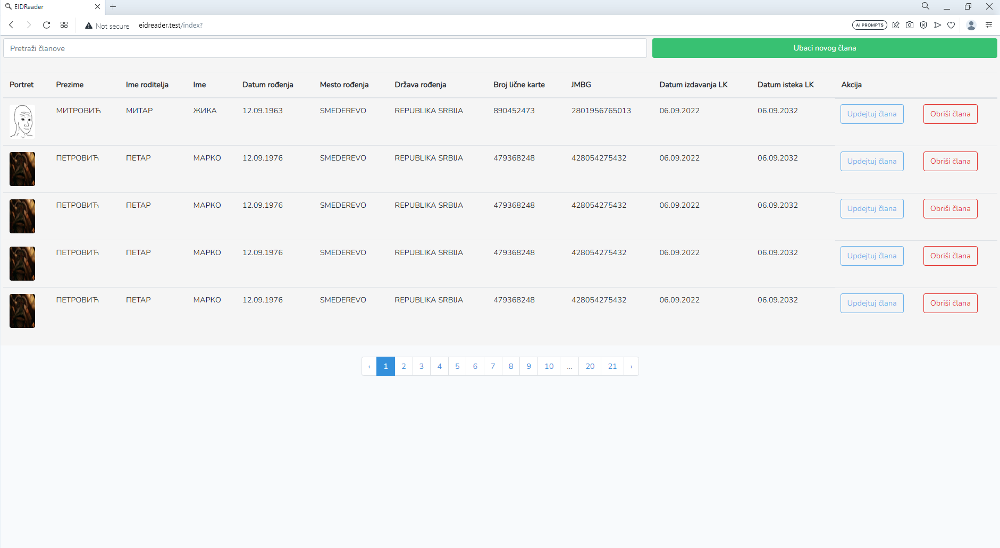

#### When added member.
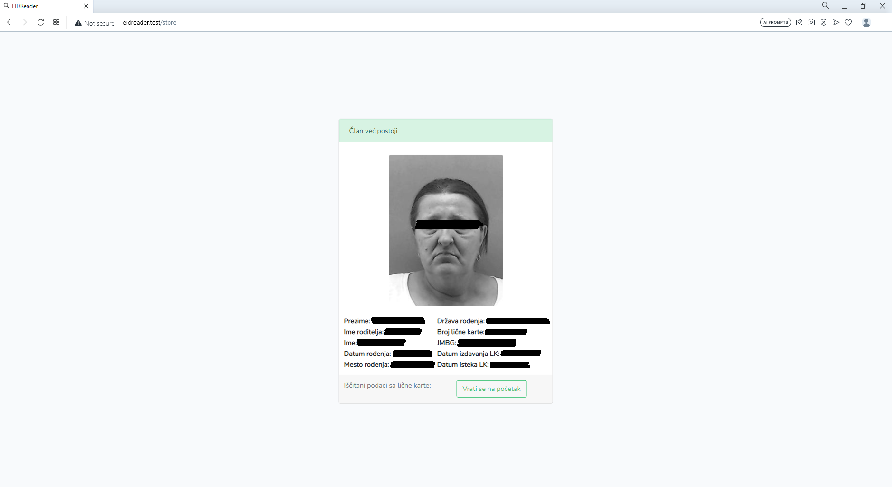